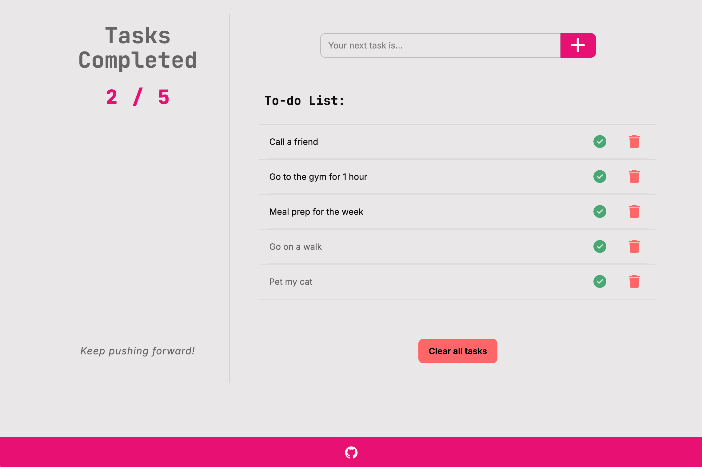

# To-Do List App
A simple, full-stack to-do list web application.

## Demo

## Overview
I built this app as an exercise to learn the basics of PHP. The project is based on this [Build a Full Stack To-Do App with PHP & MySQL](https://youtu.be) tutorial.

To build upon the tutorial, I modified the query logic to display incomplete tasks before complete tasks, then sort tasks by their original creation date. I also updated the motivational text to randomly display different text from an array of options, rather than a single static phrase.

## Built With
- PHP
- JavaScript
- MySQL
- Tailwind CSS

## Features
- Add a task
- Delete individual task or delete all tasks
- Tasks are sorted by completion status (incomplete tasks first), then creation date (newest tasks first)
- Toggle task completion status
- Randomly display different motivational phrases

## Possible Future Improvements
- Functional
    - Add ability to flag tasks as important
    - Track and display task completion dates
    - Add ability for users to submit their own motivational phrases or choose the ones they want from a list
    - Add button for users to refresh motivational phrase (or to disable them entirely)
    - Add ability to change task sort order
- UI
    - Change appearance of the check mark button to indicate an item's completion status (e.g. hollow = incomplete / solid = complete)
    - Add dark/light theme toggle or ability to pick theme
    - Create a brief tutorial (e.g. pre-made tasks with instructions like "This is an example task. Click the trash can icon to delete it.")
    - Display a visual representation of percentage of completed tasks

## Installation
To run this app locally on your computer:

### Set up the environment
1. **Clone this repository** to your computer.
2. **Download and install [MAMP](https://mamp.info)**.
3. **Move the project folder** into MAMP's root directory on your computer (`htdocs`).
    - Mac: `/Applications/MAMP/htdocs/`
    - Windows: `C:\MAMP\htdocs`
4. **Open MAMP** and click **Start**.

### Configure the database
5. Open your browser and **go to [http://localhost:8888/phpMyAdmin/](http://localhost:8888/phpmyadmin/)**.
6. **Create a new database**.
    - Click **New** from the left sidebar.
    - Name the database `full_stack_todo_app`.
    - Select **utf8mb4_general_ci** for the collation.
    - Click **Create**.
    - Click the **Import** tab.
    - **Import the `create_db.sql` file** located in your project repository.

### Run the application
7. In a new browser tab, **go to [http://localhost:8888/](http://localhost:8888/)**.
8. Click **full-stack-todo-app/** to launch and use the app.